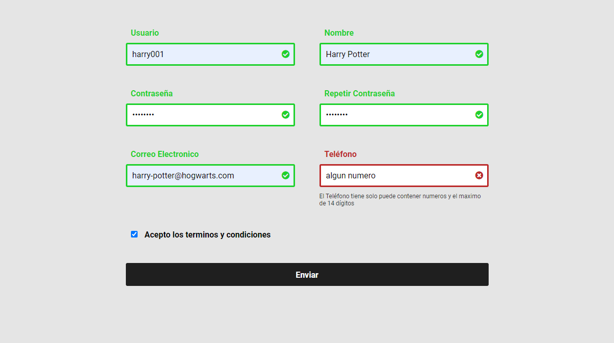

# Validar Formularios con Javascript y Expresiones Regulares

Diseño de un formulario responsivo de forma profesional con HTML5 y CSS3, Grid. Validando de forma profesional utilizando Javascript y Expresiones Regulares.

- Ver Pagina: [Link a la pagina web](https://sergio-ivan-melgarejo.github.io/validacion-formularios/)

